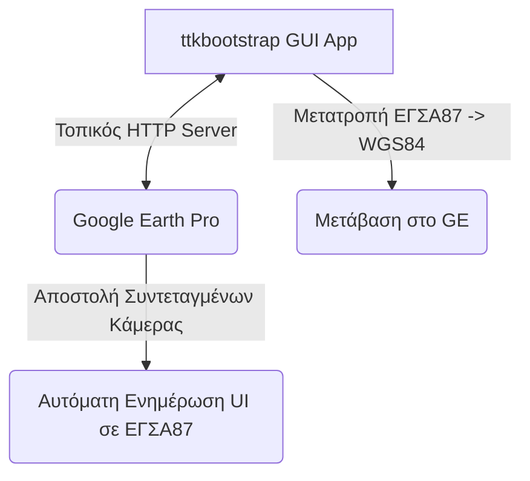

# EGSA87 to Google Earth Coordinate Converter (Egsa2GE)

Μια σύγχρονη και πρακτική λύση για τη δυναμική εμφάνιση και μετάβαση σε σημεία συντεταγμένων **ΕΓΣΑ ’87 (HGRS87 / EPSG:2100)** στο **Google Earth Pro (WGS84 / EPSG:4326)** σε πραγματικό χρόνο, χρησιμοποιώντας μια εξωτερική εφαρμογή Python (ttkbootstrap) και έναν ενσωματωμένο (embedded) τοπικό HTTP Server.

## 🎯 Το Πρόβλημα που Επιλύει

Η εφαρμογή αυτή επιλύει ένα από τα βασικά προβλήματα στον εντοπισμό μιας περιοχής μέσω Google Earth ή Google Maps, γνωρίζοντας μόνο συντεταγμένες ΕΓΣΑ87. Δυστυχώς, δεν υπάρχει η δυνατότητα δημιουργίας κάποιου plugin για το Google Earth ή το Google Maps με το οποίο ο χρήστης να μπορεί να εισάγει απευθείας συντεταγμένες ΕΓΣΑ87. 

Μέχρι τώρα, ένας χρήστης που είχε στα χέρια του ένα σύγχρονο τοπογραφικό και γνώριζε τις συντεταγμένες μιας έκτασης, έπρεπε με κάποιο τρόπο να κάνει μετατροπή των συντεταγμένων ΕΓΣΑ87 σε WGS84, και στη συνέχεια να τις πληκτρολογήσει χειροκίνητα στο Google Earth ή στο Google Maps. 

Χάρη σε αυτή την εφαρμογή τα πράγματα γίνονται πολύ απλά: Ο χρήστης πληκτρολογεί τις συντεταγμένες απευθείας σε ΕΓΣΑ87 και, πιέζοντας ένα πλήκτρο, ανοίγει το Google Earth ή το Google Maps και βλέπει άμεσα το σημείο!


---

## ✨ Βασικές Δυνατότητες & Χαρακτηριστικά

*   **Άμεση Μετάβαση (Fly-To):** Εισάγετε συντεταγμένες ΕΓΣΑ '87 και μεταβείτε αυτόματα στο αντίστοιχο σημείο στο Google Earth Pro με ομαλή πτήση (smooth fly-to), χωρίς τα γνωστά "bounce effects".
*   **Ζωντανή Παρακολούθηση Κάμερας (Camera Tracking):** Καθώς περιηγείστε στο Google Earth, το κέντρο της οθόνης (που σημαδεύεται με ένα διακριτικό σταυρόνημα) μετατρέπεται αυτόματα σε ΕΓΣΑ '87 και εμφανίζεται στην εφαρμογή (Στόχος X,Y).
*   **Προσθήκη σε Μόνιμα Σημεία:** Δυνατότητα αποθήκευσης των σημείων ενδιαφέροντος ως μόνιμα "Placemarks" στο Google Earth, μαζί με το όνομα που έχετε δώσει, για μελλοντική χρήση.
*   **100% Portable Λειτουργία:** Δεν απαιτεί πολύπλοκα plugins στο Google Earth, ούτε δημιουργεί μόνιμους φακέλους στον υπολογιστή σας. Το αρχείο επικοινωνίας δημιουργείται προσωρινά και αθόρυβα (`%TEMP%`).
*   **Αυτόματη Επανασύνδεση (Auto-Recovery):** Ακόμα και αν κλείσετε το Google Earth ή διαγράψετε κατά λάθος τη σύνδεση (Network Link), η εφαρμογή θα το εντοπίσει και θα το επαναφέρει αυτόματα στην επόμενη χρήση!
*   **Προβολή στους Χάρτες Google (Maps):** Άμεσο άνοιγμα της τοποθεσίας στο Google Maps μέσω του web browser.


---

## 📐 Αρχιτεκτονική Συστήματος & Λειτουργία

Η εφαρμογή αποφεύγει την ανάγκη ανάπτυξης περίπλοκων εσωτερικών πρόσθετων (plugins) για το Google Earth, αλλά και τη δημιουργία προσωρινών αρχείων στον δίσκο του χρήστη. Αντίθετα, λειτουργεί ως ένας **τοπικός Web Server** (στη θύρα 8000) που επικοινωνεί αμφίδρομα και "ζωντανά" μέσω HTTP με την τεχνολογία **NetworkLink** του Google Earth Pro.



### 🎯 Χαρακτηριστικό: Camera Tracking (Σταυρόνημα)
Το Google Earth επικοινωνεί αμφίδρομα με την εφαρμογή!
- Κάθε φορά που "κεντράρετε" την οθόνη του Google Earth κάπου και σταματάτε, το Google Earth στέλνει τη γεωγραφική του θέση (κέντρο οθόνης) στην εφαρμογή.
- Ένα διακριτικό "Σταυρόνημα" εμφανίζεται στο κέντρο της οθόνης του Google Earth για ακριβή στόχευση (όλα τα περιττά εικονίδια έχουν αφαιρεθεί για ένα πιο καθαρό περιβάλλον).
- Η εφαρμογή μετατρέπει τις συντεταγμένες σε ΕΓΣΑ87 και τις εμφανίζει **στο ειδικό πλαίσιο "Στόχος X,Y"** στο γραφικό περιβάλλον. Εάν ο στόχος βρίσκεται εκτός Ελλάδας (εκτός των αποδεκτών ορίων του ΕΓΣΑ87), η εφαρμογή σας ειδοποιεί εμφανίζοντας το μήνυμα "Εκτός ΕΓΣΑ87". Περιλαμβάνεται επίσης κουμπί άμεσης αντιγραφής των συντεταγμένων.

---

## 📂 Φάκελος Εργασίας (Portable Mode)

Η εφαρμογή είναι πλέον 100% portable και **δεν απαιτεί ούτε δημιουργεί** μόνιμους φακέλους στον σκληρό σας δίσκο.

Το μοναδικό αρχείο γέφυρα (`egsa87_live_link.kml`) που απαιτείται για να συνδεθεί το Google Earth με τον Web Server, δημιουργείται αθόρυβα στον προσωρινό φάκελο των Windows (`%TEMP%\Egsa2GE`) και ανοίγει αυτόματα με το πάτημα ενός κουμπιού.

---

## 🚀 Εγκατάσταση & Εκτέλεση

### Προϋποθέσεις
*   **Python 3.8** ή νεότερη
*   **Google Earth Pro** (εγκατεστημένο τοπικά)
*   Η βιβλιοθήκη **`pyproj`** (βασίζεται στο PROJ για ακριβείς γεωδαιτικές μετατροπές)

### 1. Γρήγορη Εκτέλεση με `uv` (Προτεινόμενο)
Αν χρησιμοποιείτε τον διαχειριστή πακέτων **uv**, μπορείτε να τρέξετε την εφαρμογή άμεσα μέσω της γραμμής εντολών:
```powershell
uv run egsa87-google-earth
```

### 2. Μεταγλώττιση σε Αυτόνομο Εκτελέσιμο (.exe)
```powershell
uv run --with pyinstaller --with pyproj pyinstaller EGSA2GE_Portable_v1.0.0.spec
```
*Παράγει το `EGSA2GE_Portable_v1.0.0.exe` στον φάκελο `dist\`.*

---

## 📖 Οδηγίες Χρήσης

Για αναλυτικές οδηγίες χρήσης με εικόνες, συμβουλευτείτε το **[Εγχειρίδιο Χρήσης (MANUAL.md)](docs/manual/MANUAL.md)**.

*Συνοπτικά βήματα:*
1.  **Εκκίνηση**: Ανοίξτε την εφαρμογή και βεβαιωθείτε ότι το Google Earth Pro τρέχει (εάν είναι κλειστό, η εφαρμογή θα το ανοίξει αυτόματα με την πρώτη Προβολή στο Google Earth).
2.  **Αρχική Ρύθμιση**:
    *   Η εφαρμογή διαθέτει **έξυπνη αναγνώριση διπλότυπων** και **αυτόματη επανασύνδεση**: Αν δεν υπάρχει το link στο GE, απλώς πατήστε "Προβολή στο Google Earth" και η εφαρμογή θα το φορτώσει σιωπηλά και θα σας πάει στο σημείο. Αν είναι ήδη στα Μέρη σας, η εφαρμογή απλώς επικοινωνεί μαζί του.
3.  **Πλοήγηση & Εισαγωγή (ΕΓΣΑ -> GE)**:
    *   Εισάγετε τις συντεταγμένες **Χ (Easting)** και **Υ (Northing)** σε μέτρα (π.χ. `X: 373306.33`, `Y: 4457763.39`).
    *   Ορίστε την **Απόσταση (m)** (π.χ. `200` για πολύ κοντά, `800` για καλή θέα).
    *   Πατήστε **«Προβολή στο Google Earth»** για αυτόματο zoom του Google Earth στη θέση αυτή. Το κεντρικό UI εστιάζει καθαρά στη γεωμετρία (το πεδίο περιγραφής καταργήθηκε).
4.  **Λήψη Συντεταγμένων (GE -> ΕΓΣΑ)**:
    *   Μετακινήστε τον χάρτη ελεύθερα μέσα στο Google Earth.
    *   Μόλις σταματήσετε, οι συντεταγμένες της οθόνης θα εμφανιστούν αυτόματα στο πεδίο **"Στόχος X,Y"** της εφαρμογής. Μπορείτε να τις αντιγράψετε άμεσα στο clipboard!
5.  **Εργαλεία (Συρτάρι Μενού)**:
    *   Πατήστε το κουμπί **☰** πάνω δεξιά για να εμφανίσετε το συρτάρι με πρόσθετες λειτουργίες. Εκεί θα βρείτε επιλογές όπως *Προσθήκη σε μόνιμα σημεία* και γρήγορη *Αντιγραφή WGS84*.

---

## 🛡️ Σταθερότητα Σύνδεσης & Auto-Recovery

Επειδή η επικοινωνία με το Google Earth βασίζεται σε NetworkLinks, η εφαρμογή διαθέτει ενσωματωμένους μηχανισμούς για την αποτροπή "παγώματος" ή απώλειας επικοινωνίας:

*   **Ομαλή Πτήση (Smooth Fly-To):** Έχει αφαιρεθεί το ενοχλητικό φαινόμενο όπου το Google Earth απομακρυνόταν ψηλά στον ουρανό πριν προσγειωθεί σε ένα νέο σημείο (bounce effect). Πλέον, αν η νέα μετάβαση αφορά κοντινή απόσταση (έστω και λίγων εκατοστών ή μέτρων), η κάμερα "γλιστράει" ομαλά και ακαριαία, χωρίς περιττές και χρονοβόρες κινήσεις της κάμερας σε μεγάλο υψόμετρο.
*   **Auto-Recovery (Αυτόματη Επανασύνδεση):** Εάν για οποιονδήποτε λόγο διαγράψετε κατά λάθος το `ΕΓΣΑ87 Live Link` μέσα από το Google Earth, η εφαρμογή θα το αντιληφθεί! Την επόμενη φορά που θα πατήσετε «🌍 Προβολή στο Google Earth», η εφαρμογή θα επιχειρήσει **αυτόματα** να ξαναστείλει το Link στο Google Earth και να ολοκληρώσει την πτήση χωρίς να χρειαστεί να κάνετε τίποτα.
*   **💡 Βέλτιστη Πρακτική (My Places):** Από προεπιλογή, το `ΕΓΣΑ87 Live Link` φορτώνεται στα **«Προσωρινά Μέρη»** (Temporary Places) του Google Earth. Αν θέλετε **απόλυτη σταθερότητα**, προτείνεται να σύρετε (drag & drop) το Link στα **«Μέρη μου»** (My Places) και να αποθηκεύσετε. Το Google Earth διαχειρίζεται τα «Μέρη μου» πολύ πιο έξυπνα, διατηρώντας τη σύνδεση ενεργή ακόμα και αν ανοιγοκλείσετε την εφαρμογή πολλές φορές!

---

## 📄 Άδεια Χρήσης (License)

Αυτό το project διατίθεται ως Λογισμικό Ανοιχτού Κώδικα (Open Source) υπό την άδεια [MIT License](LICENSE).
Μπορείτε ελεύθερα να το χρησιμοποιήσετε, να το τροποποιήσετε και να το διανείμετε, με μόνη προϋπόθεση την αναφορά στον δημιουργό. 

Το έτοιμο εκτελέσιμο πρόγραμμα (`.exe`) για Windows μπορείτε να το κατεβάσετε απευθείας από την ενότητα **[Releases](../../releases)** του GitHub.

---

## 👨‍👦 Δημιουργοί

Αυτή η εφαρμογή αναπτύχθηκε από τον **Ιωάννη Μάρα** με τη συμβολή του πατέρα του, **Γεώργιου Μάρα**. 
Η έμπνευση για το έργο γεννήθηκε όταν ο Ιωάννης παρατήρησε τις πρακτικές δυσκολίες που αντιμετώπιζε καθημερινά ο πατέρας του ως δασολόγος, προσπαθώντας να εντοπίσει συντεταγμένες ΕΓΣΑ87 στο πεδίο και στο γραφείο. 

Στόχος μας ήταν να μετατρέψουμε αυτή την πραγματική ανάγκη σε ένα ανοιχτό, πρακτικό εργαλείο, ελπίζοντας να διευκολύνουμε την καθημερινότητα των δασολόγων, μηχανικών και τοπογράφων σε όλη την Ελλάδα.
