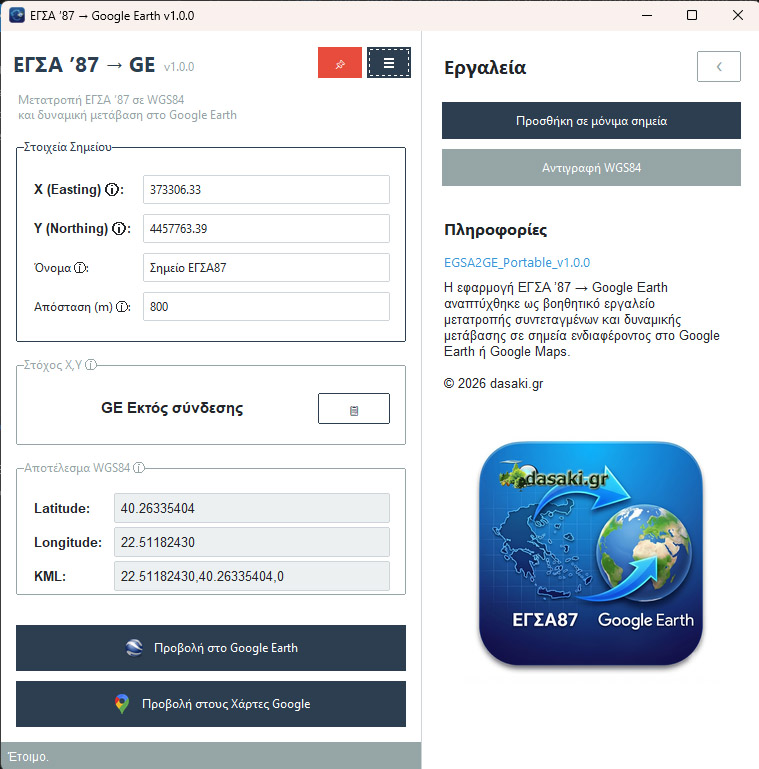
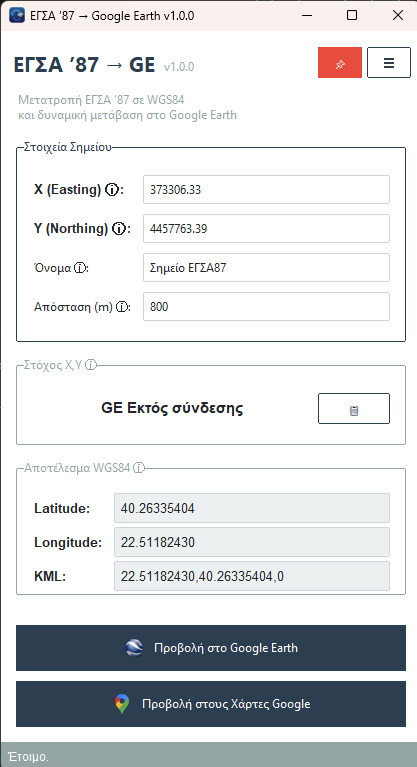

# Εγχειρίδιο Χρήσης: ΕΓΣΑ ’87 → Google Earth (Egsa2GE)

Καλώς ήρθατε στο αναλυτικό εγχειρίδιο χρήσης της εφαρμογής Egsa2GE. Η εφαρμογή έχει σχεδιαστεί για να είναι εξαιρετικά απλή στη χρήση, ενώ ταυτόχρονα προσφέρει ισχυρά εργαλεία για τη διασύνδεση τοπικών Ελληνικών συντεταγμένων με το παγκόσμιο σύστημα του Google Earth.

---

## 1. Το Περιβάλλον της Εφαρμογής

Η κύρια οθόνη χωρίζεται σε έξυπνες ενότητες:
*   **Καρτέλα Εισαγωγής (Στοιχεία Σημείου):** Εδώ εισάγετε τις συντεταγμένες σε ΕΓΣΑ '87.
*   **Πλαίσιο Στόχου (Camera Tracking):** Προβολή αντίστροφων συντεταγμένων (από το Google Earth).
*   **Πλαίσιο Μετατροπής (WGS84 & KML):** Εμφάνιση της άμεσης μετατροπής και του KML format.
*   **Κουμπιά Δράσης (Κάτω μέρος):** Άμεση προβολή σε Google Earth ή Google Maps.
*   **Πλευρικό Μενού:** Πρόσθετες λειτουργίες κρυμμένες σε ένα όμορφο "συρτάρι" (κουμπί **☰**).

---

## 2. Βασικές Λειτουργίες

### Α. Προβολή ενός σημείου στο Google Earth (ΕΓΣΑ87 -> GE)
Η πιο βασική λειτουργία της εφαρμογής είναι να σας "ταξιδέψει" άμεσα στο σημείο που επιθυμείτε:
1. Στα πεδία **Χ (Easting)** και **Y (Northing)**, πληκτρολογήστε τις συντεταγμένες σας (π.χ. `373306.33` / `4457763.39`).
2. Προαιρετικά, μπορείτε να δώσετε ένα **Όνομα** στο σημείο, για να εμφανίζεται με ταμπελάκι στο Google Earth.
3. Επιλέξτε την **Απόσταση (m)** θέασης (π.χ. `100` για κοντινή θέα, `1000` για γενική εποπτεία).
4. Πατήστε το μπλε κουμπί **"🌍 Προβολή στο Google Earth"**.
5. Εάν το Google Earth είναι κλειστό, η εφαρμογή θα το ανοίξει αυτόματα. Στη συνέχεια, θα πραγματοποιήσει μια ομαλή πτήση (smooth fly-to) με ακρίβεια στο σημείο που επιλέξατε!

### Β. Αντίστροφη Εύρεση Συντεταγμένων (Camera Tracking)
Όχι μόνο στέλνουμε σημεία στο Google Earth, αλλά η εφαρμογή "διαβάζει" και το τι βλέπετε εσείς στο χάρτη!

1. Καθώς έχετε ανοιχτό το Google Earth, δοκιμάστε να περιηγηθείτε ελεύθερα στο χάρτη (zoom, pan).
2. Στο κέντρο της οθόνης υπάρχει ένα διακριτικό **σταυρόνημα (crosshair)**.
3. Μόλις σταματήσετε σε ένα σημείο, η εφαρμογή Egsa2GE θα διαβάσει άμεσα τη θέση αυτού του σταυρονήματος.
4. Στην ενότητα **"Στόχος X,Y"** στο γραφικό περιβάλλον, θα δείτε τις συντεταγμένες **ΕΓΣΑ '87** να ενημερώνονται ζωντανά!
5. Εάν το σημείο που κοιτάτε είναι εκτός των ορίων της Ελλάδας, η εφαρμογή θα σας ειδοποιήσει αναγράφοντας *"Εκτός ΕΓΣΑ87"*.
6. Μπορείτε να αντιγράψετε άμεσα αυτές τις συντεταγμένες πατώντας το εικονίδιο αντιγραφής 📋 δίπλα τους.

### Γ. Προβολή στους Χάρτες Google (Google Maps)
Αν δεν επιθυμείτε να ανοίξετε το Google Earth ή θέλετε μια γρήγορη ματιά στο δρόμο (π.χ. Street View):
1. Εισάγετε τις συντεταγμένες ΕΓΣΑ '87.
2. Πατήστε το πράσινο κουμπί **"🗺️ Προβολή στους Χάρτες Google"**.
3. Θα ανοίξει αυτόματα ο browser (περιηγητής) σας κατευθείαν στην πινέζα του σημείου στο Google Maps.

### Δ. Το Πλευρικό Μενού (Εργαλεία)
Πατώντας το κουμπί **☰** πάνω δεξιά στην οθόνη, αποκαλύπτεται το πλευρικό συρτάρι που περιέχει έξτρα εργαλεία:
*   **Προσθήκη σε Μόνιμα Σημεία:** Όταν πατάτε "Προβολή", το σημείο μετακινείται στο Google Earth αλλά παραμένει προσωρινό. Αν θέλετε να το κρατήσετε μόνιμα στα "Μέρη μου" του Google Earth με το όνομα του, πατήστε αυτό το κουμπί!
*   **Αντιγραφή WGS84:** Αντιγράφει στο πρόχειρο (clipboard) τις συντεταγμένες σε παγκόσμιο μορφότυπο (Latitude / Longitude) για να τις στείλετε κάπου ή να τις επικολλήσετε.

---

## 3. Χρήσιμα Μυστικά & Σταθερότητα (Auto-Recovery)

Η εφαρμογή μας λειτουργεί έξυπνα στο παρασκήνιο:
- Στο Google Earth, στα αριστερά στο δέντρο, θα δείτε να εμφανίζεται ένα φάκελος **"ΕΓΣΑ87 Live Link"**. Αυτός είναι ο "δίαυλος επικοινωνίας" μας.
- **Μη φοβάστε τα σφάλματα:** Αν κατά λάθος κλείσετε το Google Earth ή διαγράψετε το Live Link, απλά πατήστε ξανά το "Προβολή στο Google Earth". Η εφαρμογή το αντιλαμβάνεται και **επανασυνδέεται αυτόματα**!
- **💡 Tip για Προχωρημένους (Μέγιστη Σταθερότητα):** Για την πιο αδιάλειπτη εμπειρία, πιάστε το `ΕΓΣΑ87 Live Link` από τα *Προσωρινά Μέρη* (Temporary Places) του Google Earth και σύρετέ το (drag & drop) στα *Μέρη Μου* (My Places). Αποθηκεύστε τα μέρη σας! Έτσι ο δίαυλος θα είναι πάντα ανοιχτός και έτοιμος με το που ανοίγετε το Google Earth.
